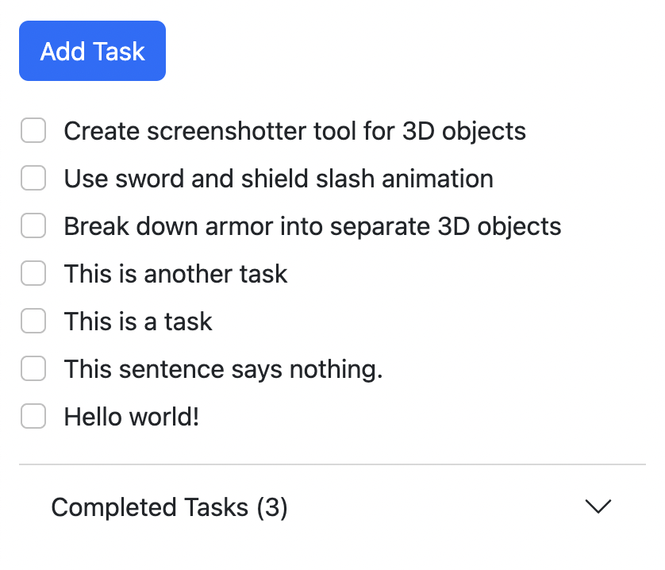

# web3-todo-tasks

This package is for a web3 end-to-end encrypted task manager.

Encryption key is derived from wallet signature using Argon2 and HKDF, and it is stored on the client side. Tasks are encrypted with AES using the encryption key and stored in DynamoDB. The approach is similar to the one in the [Skiff Privacy whitepaper](https://skiff-org.github.io/whitepaper/Skiff_Whitepaper_2022.pdf).
